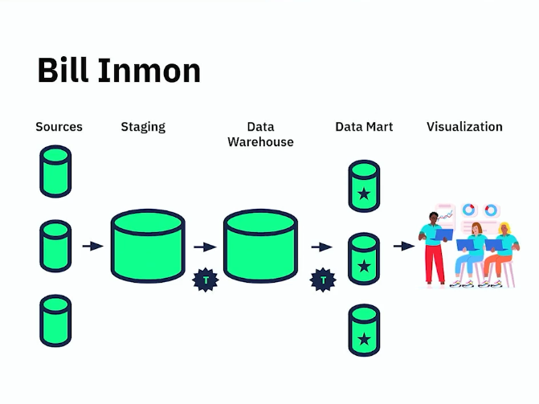
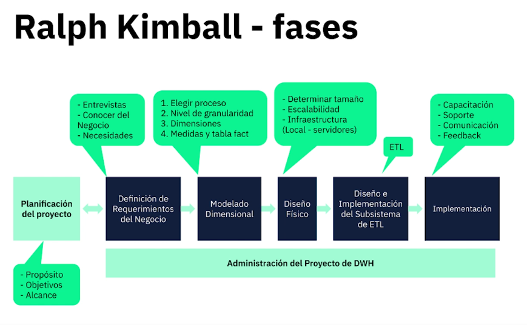

# Data Warehouse

* Conceptos básicos
  - [¿Que es un Data Warehouse?](#que-es-un-data-warehouse)
  - [OLTP vs OLAP](#oltp-vs-olap)
  - [Metodologías de DWH](#metodologías-de-dwh)

## Conceptos básicos

### Que es un Data Warehouse

Data Warehouse o `DWH` es una base de datos que contiene informacion de muchas fuentes diferentes, y se convertira en nuestra fuente unica de verdad. Los informes creados a aprtir de una Dta Warehouse son usado para la toma de decisiones. Estos centros de datos pueden estar conformados por pequeños segmentos de datos llamados `Data Marts` que esta orientado a un area de negocios en particular, podemos tener data marts de ventas, Finanzas y auditoria.

Si bien podemos pensar y entender los DWH como bases de datos, esto no seria del todo cierto. Puesto que el nivel de procesamiento y el fin de un DWH es totalmente distinto a una BBDD. La principal diferencia radica en el procesamiento de los datos como tal, para esto debemos entender que es un procesamiento **OLAP** y un procesamiento **OLTP**.

### OLTP vs OLAP

Tanto el procesamiento analítico en línea (OLAP) como el procesamiento de transacciones en línea (OLTP) son sistemas de administración de bases de datos para almacenar y procesar datos en grandes volúmenes. Necesitan una infraestructura de TI eficiente y confiable para funcionar sin problemas. Puede utilizarlos tanto para consultar datos existentes como para almacenar datos nuevos. Ambos respaldan la toma de decisiones basada en datos en una organización.

El propósito principal del procesamiento analítico en línea (OLAP) es analizar los datos agregados, mientras que el propósito principal del procesamiento de transacciones en línea (OLTP) es procesar las transacciones de bases de datos. Los sistemas de OLAP se utilizan para generar informes, realizar análisis de datos complejos e identificar tendencias. Por el contrario, los sistemas de OLTP se utilizan para procesar pedidos, actualizar el inventario y administrar las cuentas de los clientes.

Existen, de todas formas, diferencias claves entre OLAP y OLTP:

* Arquitectura de datos:
  - La arquitectura de las bases de datos de OLAP prioriza la lectura de datossobre las operaciones de escritura de datos. Puede realizar consultas complejas de forma rápida y eficiente en grandes volúmenes de datos. La disponibilidad es una preocupación de baja prioridad, ya que el principal caso de uso son los análisis.
  - la arquitectura de las bases de datos de OLTP prioriza las operaciones de escritura de datos. Está optimizada para cargas de trabajo que requieren mucha escritura y puede actualizar datos transaccionales de alta frecuencia y gran volumen sin comprometer la integridad de los datos.

* Rendimiento:
  - Los tiempos de procesamiento del OLAP pueden variar de minutos a horas según el tipo y el volumen de datos que se analicen. La frecuencia de actualización de datos también varía entre los sistemas, de diaria a semanal o incluso mensual.
  - Las bases de datos de OLTP administran las actualizaciones de las bases de datos en tiempo real. Las actualizaciones son rápidas, breves y usted o sus usuarios las activan. El procesamiento de flujos se utiliza a menudo en lugar del procesamiento por lotes.

* Requisitos:
  - Los sistemas de OLAP actúan como un almacén de datos centralizado y extraen datos de múltiples almacenamientos, bases de datos relacionales y otros sistemas. Los requisitos de almacenamiento van desde terabytes (TB) hasta petabytes (PB). Las lecturas de datos también pueden requerir un uso intensivo de recursos de computación y necesitar servidores de alto rendimiento.
  - Puede medir los requisitos de almacenamiento del OLTP en gigabytes (GB). Las bases de datos de OLTP también se pueden borrar una vez que los datos se carguen en un almacenamiento de datos de OLAP o lago de datos relacionado. Sin embargo, los requisitos de computación de los sistemas de OLTP también son altos.

### Metodologías de DWH

Las metodologias tienen diferentes origenes, dimensiones y visualizaciones, las principales son Bill Inmon, Ralph Kimball

* Bill Inmon:

Nos propone la creacion de un modelo con Staging, donde todos los datos seran agrupados dentro de una base de datos temporal, pasaremos por medio de un proceso de ETL los datos del Staging a un Data warehouse, de esta forma no afectaremos directamente los datos presentes en un DWH, y luego, a partir del DWH construiremos los data marts correspondientes.

  

* Ralph Kimball:

Nos propone pasar directamente de un area de Staging a la creacion de los data marts, sin necesidad de crear un DWH ya que uno y otro son independientes de la existencia del otro.

  

De todas formas, Ralph Kimball propone una serie de fases durante la elaboracion de estos recursos:

  

* Hefesto:

La metodologia hefesto propone la siguiente secuencia o pasos durante la elaboracion del DWH:

  

Si bien son diversas las fuentes y metodologias a la hora de elaborar los DWH, se pueden tomar lo mejor de cada uno o lo que uno crea necesario en base a los requerimientos del proyecto. Hay que recordar de que son muchas las variables a tener en cuenta cuando queremos elaborar un proyecto, ya sea el tiempo, el presupuesto, el tamaño del equipo, los requerimientos del cliente y base a lo que se puede realizar, etc. 