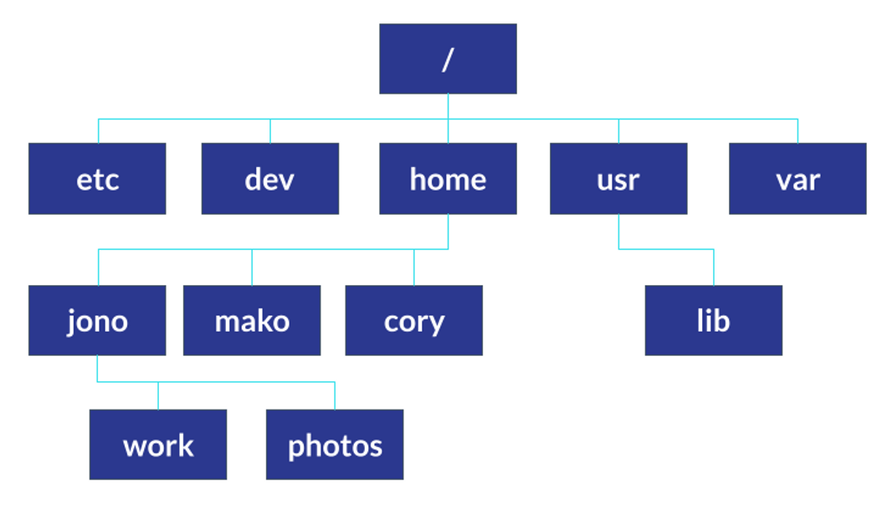

# RESUMEN DE LINUX

* Indices

### ¿Que es la terminal?

La terminal es un programa que ejecuta líneas de comandos, que a su vez estas líneas de comando ejecutan acciones y aquí tienes que aprender dos conceptos: terminal y shell.

Es una interfaz gráfica que simula una linea de comandos y cuando hablamos de una línea de comandos nos referimos a una `shell`.

- **Terminal**: es la ventanita que nos muestra el prompt. Este aloja la shell.
- **Linea de comandos**: programa que toma comandos y los pasa al sistema operativo para hacer algo.

La terminal es mucho menos pesada que el sistema de ventanas y el sistema de ficheros porque te comunicas directamente con los recursos del sistema operativo sin pasar por la interfaz gráfica.

Además, hay casos en los que no cuentas con una interfaz gráfica o también puede dañarse y tendrás que resolver utilizando la terminal de comandos.

### Aprendiendo a caminar en la terminal

El sistema de archivos, será el árbol por el que nos estaremos moviendo en la terminal.

Aquí se encuentran los archivos del sistema operativo, así como también los ejecutables, controladores, archivos de configuración, etcétera.

En la carpeta `home` es donde se encuentran los usuarios del sistema operativo. Dentro de la terminal identificamos esta carpeta con el símbolo llamado virgulilla `~`.

* Primeros comandos

| Comando | Accion |
| ----- | ----- |
| ls | Lista los archivos y carpetas del directorio. |
| ls -l | Lista los archivos y carpetas con toda la información de cada uno. |
| ls -lh | Lista los archivos y carpetas con la información legible para humanos. |
| cd | Mueve la terminal al directorio `home` del usuario. |
| cd {folder} | Mueve la terminal al directorio indicado. |
| clear | Limpia la pantalla de la terminal (shortcut: `cmd + L`). |
| pwd | Imprime la ruta actual en la que nos encontramos en la terminal. |
| file {name_file} | Describe el tipo de archivo que le pasamos como parámetro. |

* Rutas relativas

Tenemos dos parámetros que nos ayudan a trabajar con las rutas en la terminar, estos parámetros son de rutas relativas. Los conocemos como `.` y `..`.

El primer de ellos nos ubica en el directorio actual y el segundo nos regresa un directorio.

#### Manipulando archivos y directorios

* Listando elementos

| Comando | Accion |
| ----- | ----- |
| ls -la | Lista todos los elementos del directorio, incluidos los ocultos. |
| ls -ls | Lista todos los elementos iniciando por los más pesados. |
| ls -lr | Lista todos los elementos de forma inversa. |
| tree | Despliega todos nuestros directorios como un árbol. |
| tree -L {#} | Despliega los elementos que se encuentren en el nivel indicado. |

* Manipulación de elementos

| Comando | Accion |
| ----- | ----- |
| mkdir {folder} | Crea un nuevo directorio con el nombre indicado. |
| touch {file} | Crea un nuevo archivo con el nombre indicado. |
| cp {original} {copia} | Copia un archivo. |
| mv {file} {path} | Mueve el archivo a la ubicación deseada. |
| rm {file} | Renombra el archivo o directorio. |
| rm -i {file} | Pide confirmación antes de eliminar el archivo. |
| rm -r {folder} | Elimina el directorio indicado. |

#### Explorando el contenido de nuestros archivos

La terminal nos permite explorar archivos desde ella misma, así evitamos abrirlos por completo. Los comandos para explorar archivos están listados a continuación.

* Comandos de la clase

| Comando | Accion |
| ----- | ----- |
| head {file} | Muestra las primeras 10 líneas de un archivo de texto. |
| head {file} -n {#} | Muestra las primeras líneas de código indicadas. |
| tail {file} | Muestra las últimas 10 líneas de un archivo de texto. |
| tail {file} -n {#} | Muestra las últimas líneas de un archivo de código indicadas. |
| less {file} | Muestra todo el archivo de texto seleccionado. |
| open | Abre un archivo desde la terminal (MacOs). |
| xdg-open | Abre un archivo desde la terminal (Linux). |
| nautilus | Abrir el sistema de archivos (Linux) |

💡 Para detener un proceso que se esté ejecutando en la terminal basta con utilizar la combinación de teclas `ctrl + c` para interrumpirlo.