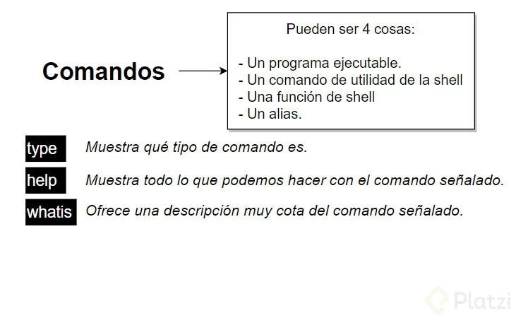
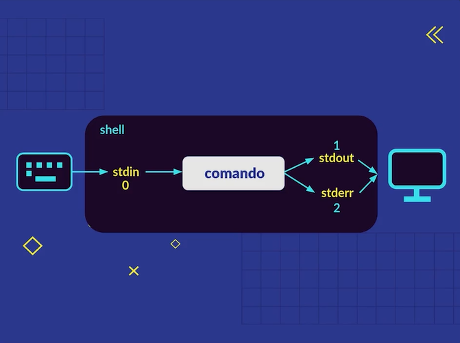

# RESUMEN DE LINUX

* Primeros pasos
  - [La terminal](#la-terminal)
  - [Aprendiendo a caminar en la terminal](#aprendiendo-a-caminar-en-la-terminal)
  - [Manipulando archivos y directorios](#manipulando-archivos-y-directorios)
  - [Explorando el contenido de nuestros archivos](#explorando-el-contenido-de-nuestros-archivos)
  - [Los comandos](#los-comandos)
  - [Wildcards](#wildcards)
* Redireccion, permisos, comandos de busqueda
  - [Redireccionamiento](#redirecciones-cómo-funciona-la-shell)
  - [Pipe Operator](#redirecciones-cómo-funciona-la-shell)
  - [Operadores de control](#encadenando-comandos-operadores-de-control)

### La terminal

La terminal es un programa que ejecuta líneas de comandos, que a su vez estas líneas de comando ejecutan acciones y aquí tienes que aprender dos conceptos: terminal y shell.

Es una interfaz gráfica que simula una linea de comandos y cuando hablamos de una línea de comandos nos referimos a una `shell`.

- **Terminal**: es la ventanita que nos muestra el prompt. Este aloja la shell.
- **Linea de comandos**: programa que toma comandos y los pasa al sistema operativo para hacer algo.

La terminal es mucho menos pesada que el sistema de ventanas y el sistema de ficheros porque te comunicas directamente con los recursos del sistema operativo sin pasar por la interfaz gráfica.

Además, hay casos en los que no cuentas con una interfaz gráfica o también puede dañarse y tendrás que resolver utilizando la terminal de comandos.

### Aprendiendo a caminar en la terminal

El sistema de archivos, será el árbol por el que nos estaremos moviendo en la terminal.

<p align='center'>
  
</p>

Aquí se encuentran los archivos del sistema operativo, así como también los ejecutables, controladores, archivos de configuración, etcétera.

En la carpeta `home` es donde se encuentran los usuarios del sistema operativo. Dentro de la terminal identificamos esta carpeta con el símbolo llamado virgulilla `~`.

* **Primeros comandos**

| Comando | Accion |
| ----- | ----- |
| ls | Lista los archivos y carpetas del directorio. |
| ls -l | Lista los archivos y carpetas con toda la información de cada uno. |
| ls -lh | Lista los archivos y carpetas con la información legible para humanos. |
| cd | Mueve la terminal al directorio `home` del usuario. |
| cd {folder} | Mueve la terminal al directorio indicado. |
| clear | Limpia la pantalla de la terminal (shortcut: `cmd + L`). |
| pwd | Imprime la ruta actual en la que nos encontramos en la terminal. |
| file {name_file} | Describe el tipo de archivo que le pasamos como parámetro. |

* **Rutas relativas**

Tenemos dos parámetros que nos ayudan a trabajar con las rutas en la terminar, estos parámetros son de rutas relativas. Los conocemos como `.` y `..`.

El primer de ellos nos ubica en el directorio actual y el segundo nos regresa un directorio.

### Manipulando archivos y directorios

* **Listando elementos**

| Comando | Accion |
| ----- | ----- |
| ls -la | Lista todos los elementos del directorio, incluidos los ocultos. |
| ls -ls | Lista todos los elementos iniciando por los más pesados. |
| ls -lr | Lista todos los elementos de forma inversa. |
| tree | Despliega todos nuestros directorios como un árbol. |
| tree -L {#} | Despliega los elementos que se encuentren en el nivel indicado. |

* **Manipulación de elementos**

| Comando | Accion |
| ----- | ----- |
| mkdir {folder} | Crea un nuevo directorio con el nombre indicado. |
| touch {file} | Crea un nuevo archivo con el nombre indicado. |
| cp {original} {copia} | Copia un archivo. |
| mv {file} {path} | Mueve el archivo a la ubicación deseada. |
| rm {file} | Renombra el archivo o directorio. |
| rm -i {file} | Pide confirmación antes de eliminar el archivo. |
| rm -r {folder} | Elimina el directorio indicado. |

### Explorando el contenido de nuestros archivos

La terminal nos permite explorar archivos desde ella misma, así evitamos abrirlos por completo. Los comandos para explorar archivos están listados a continuación.

* Comandos de la clase

| Comando | Accion |
| ----- | ----- |
| head {file} | Muestra las primeras 10 líneas de un archivo de texto. |
| head {file} -n {#} | Muestra las primeras líneas de código indicadas. |
| tail {file} | Muestra las últimas 10 líneas de un archivo de texto. |
| tail {file} -n {#} | Muestra las últimas líneas de un archivo de código indicadas. |
| less {file} | Muestra todo el archivo de texto seleccionado. |
| open | Abre un archivo desde la terminal (MacOs). |
| xdg-open | Abre un archivo desde la terminal (Linux). |
| nautilus | Abrir el sistema de archivos (Linux) |

> 💡 Para detener un proceso que se esté ejecutando en la terminal basta con utilizar la combinación de teclas `ctrl + c` para interrumpirlo.

### Los comandos

Un comando es un mensaje enviado al ordenador que provoca una respuesta en este sistema y se comporta como una orden, pues informa al dispositivo informático que debe ejecutar una acción según la indicación que pueda enviarse.

Cada sistema operativo incorpora un determinado número de comandos básicos, que permiten ejecutar las tareas más simples con órdenes directas. A continuación conocerás todo lo relacionado con sistemas operativos basados en UNIX y sus comandos básicos en la terminal.

<p align='center'>
  
</p>

Un comando puede ser cuatro cosas:

1. *Un programa ejecutable*.
2. *Un comando de utilidad de la `shell`*.
3. *Una función de `shell`*.
4. *Un alias, ejemplo, ls.*

> 💡 El comando type es un comando que nos permite analizar la naturaleza de otros comandos.

```bash
type ls

```

Para crear alias en la terminal podemos hacer uso de la palabra reservada alias, este nos crea un alias temporal para la sesión actual en la que estamos trabajando, pero podemos hacer que este alias sea persistente.

```bash
alias l="ls -lh"

```

* Ejemplos de comandos básicos para obtener ayuda

  | Comando | Accion |
  | ----- | ----- |
  | help <comando> | Nos permite consultar un poco de documentación de un comando 📄. |
  | man <comando> | De manual, nos permite conocer mucha más información de un comando. |
  | info <comando> | Similar al anterior, pero un poco resumido y con otro formato. |
  | whatis <comando> | Describe un comando en una sola línea ☺️. No funciona con todos. |

### Wildcards

Las wildcards o comodines son una serie de caracteres especiales que nos permiten encontrar patrones o realizar búsquedas más avanzadas. Es aplicable para archivos y directorios.

Las wildcards te sirven para realizar seccionamiento de archivos o directorios, ademas de `ls` los wildcards tambien pueden usarse con cualquier comando que realice la manipulación de archivos como `mv`, `cp` y `rm`. Los tipos de wildcards son: 

***Buscar todo (\*)***<br>
El asterisco te ayuda a buscar toda la información dentro de una carpeta, pero puedes limitar su uso. Si por ejemplo quieres buscar los archivos que tengan una extensión “.png”, escribes: <br>
```bash
ls -l *.png
```
También lo puedes poner al final, si quisieras buscar, todos los archivos que comiencen por unos caracteres específicos, entonces   escribes esos caracteres y luego el asterisco.<br>

```bash
ls -l txt*
```
<br>

***Buscar por cantidad de caracteres (?)***<br>
Filtrar archivos que contengan solo un carácter después de la palabra especificada.<br>

```bash
ls datos?
```
Pero si sabes que no tiene un solo caracter, sino que tiene varios, entonces escribes tantos signos de interrogación como caracteres existan.<br>

```bash
ls datos???
```
<br>

***Buscar por caracteres específicos ([])***<br>
Si quieres buscar por varios caracteres específicos se usan corchetes. Para utilizarlos tienes que colocar dentro de los corchetes los caracteres que quieres buscar. Por ejemplo, si quisieras buscar los archivos que comiencen por las letras “c” o “i”, entonces escribes:<br>

```bash
ls -l [ci]*
```
Lo que indica el comando es que busque los archivos que comiencen por la letra “c” o por la letra “i” y que tengan lo que sea por delante. Cuando buscamos con esta wildcard ten en cuenta que es case sensitive, por lo que la letra “i” no es lo mismo que la letra “I”.<br>

```bash
ls -l [cCiI]*
```
Por último, si quieres buscar por rango de números también tienes que usar esta wildcard. Para hacerlo, escribe el rango de números que quieres buscar separados por un guion.<br>
  
```bash
ls -l foto[2-6]*
```
<br>

***Filtrar todos los archivos y directorios por funcion \[\[\]]***<br>
Tambien pueden utilizarse ciertas funciones para buscar ya por mayusculas, minusculas o incluso si poseen numeros.<br>

```bash
ls [[:upper:]]*
ls [[:lower:]]*
```
### Redirecciones: cómo funciona la shell

En la consola nosotros generamos una entrada cuando escribimos y una salida casi siempre que ejecutamos un comando.

A las entradas típicamente se les suele llamar *Standard Input* y a las salidas *Standard Output*, además se les suele abreviar como **stdin** y **stdout** respectivamente, pero tambien existe un *Standard Error* o **stderr**. Cada uno de ellos tiene un numero de operacion o **file descriptor**:

* stdin -> 0
* stdout -> 1
* stderr -> 2

<p align='center'></p>

Cada vez que trabajamos con la terminal estamos generando inputs y outputs, por ejemplo:

```shell
ls -lh
```

Aqui el comando (Standar input) obtiene una lista de archivos (Standar output). Ahora, podriamos evitar que esa informacion termine en la consola y redirigirla a un archivo. Por suerte tenemos el operador `>` con el cual podemos redirigir todo a un archivo de texto, por ejemplo:

```shell
ls -lh > output.txt
```

Ahora, un detalle particular del operador `>` es que sobreescribe la informacion. Esto significa que si en el archivo `output.txt` ya contiene informacion, sera reemplazada. Para evitar que esto suceda, en caso que asi sea necesario, podemos utilizar el operador `>>`

```shell
ls -lh >> output.txt
```

Pero, ¿que pasa si intentamos redireccionar un error?, como dijimos un **stdin** y un **stdout** poseen un file descriptior de 0 y 1 respectivamente. Pero los errores poseen su propio file descriptor que es **stderr** que es el 2. Por ejemplo, supongamos que tratamos de redireccionar una lista de archivos con un error de sintaxis en el comando `ls`:

```shell
ls -lñ
```

Para capturar el error y poder redirigirlo debemos aplicar el operador `2>`

```shell
ls -lñ > output.txt 2> errors.txt
```

Incluso podemos capturar dentro del mismo archivo tanto las operaciones exitosas como los posibles errores.

```shell
ls -l output.txt 2>&1
```

#### Tabla de operadores

| Operador | Función | 
| --- | --- | 
| > | Redirecciona la salida. Por defecto redirecciona el Standar Output | 
| >> | Concatena la salida con lo que ya tenga el archivo a donde se está redirigiendo la salida | 
| 2> | Redirecciona el file descriptor 2 (En este caso Standar Error) | 
| 2>&1 | Redirecciona el file descriptor 2 y 1 |

### Redirecciones: pipe operator

Un *pipe* es un flujo de datos que circula entre dos procesos que, o bien están estrechamente vinculados, o no tienen un origen común. Esto quiere decir que el resultado arrojado por un programa servirá como entrada para otro programa. Esto te permite, entre otras cosas, dividir grandes problemas en problemas más pequeños y así obtener una mejor visión de conjunto.

La sintaxis de pipes:

```
Comando-1 | Comando-2 | ... | Comando-N
``` 
> La gran diferencia de un redireccionamiento a travez del operador `>` es que los pipe operator permiten concatenar multiples comandos.

```shell
cat contents.txt | grep file
0 Aug  9 13:55  file1
0 Aug  9 13:55  file2
0 Aug  9 13:55  file3
0 Aug  9 13:55  file4
0 Aug  9 13:55  file5
```

```shell
ls -lh | tee texto.txt | sort | less
```

#### Tabla de operadores

| Operador | Función | 
| --- | --- |
| cat | permite concatenar el contenido de dos archivos de texto, tambien crear nuevos archivos e ingresar informacion en ellos |
| tee | permite leer un `stdin` y pasar esta informacion como un `stdout` |
| sort | Organiza allfabéticamente una salida | 

> estos operadores son sumamente amplios y pueden ser usados de diferentes maneras, como por ejemplo el operador `tee`

### Encadenando comandos: operadores de control

Los operadores de control son símbolos reservados por la terminal que nos permiten encadenar comandos.

Si usas constantemente la tecla enter para ejecutar varios comandos, puedes evitarlo si usas el operador `;` que separa los comandos que estamos ejecutando.

```shell
mkdir proyectos; ls; datos
```

Pero si observamos con atencion, el operador `;` nos permite ejecutar varios comandos en una sola linea de forma *sincrona*. En ocasiones necesitamos ejecutar comandos al mismo tiempo sin esperar que se ejecuten uno detras del otro.

El operador `&` nos permite ejecutar varios comandos de manera asincrona

```shell
date & echo 'hola' & cal
```

En ocasiones necesitamos ejectuar comandos en base a ciertas condiciones.

El operador `&&` nos permite escribir varios comandos que se ejectuan en orden si y solo si el anterior comando se ha ejecutado con exito. De no ser asi, sera interrumpido el proceso.

```shell
cd proyectos && cat textos.txt && ls
```

De forma contraria contamos con el operador `||` el cual ira ejecutando de forma ordenada todos los comandos sin importar si se lanzaron de forma correcta o no.

```shell
cd proyectos || cambia-carpeta proyectos && mkdir textos
```

#### Tabla de operadores

| Operador | Función | 
| --- | --- | 
| ; | Ejecuta de forma síncrona los comandos específicados | 
| & | Ejecuta de forma asíncrona los comandos específicados | 
| && | Ejecuta el comando si el anterior se ejecutó correctamente | 
| \|\| | Ejecuta el comando si el anterior o la combinación de los anteriores resultaron en verdadero |