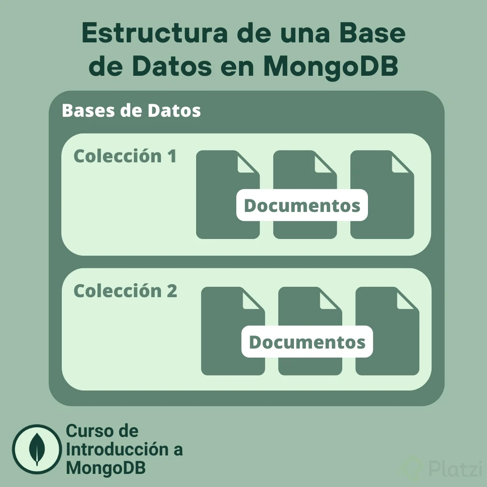
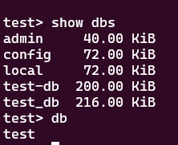

# RESUMEN DE MONGODB

* ¿Que son las bases de datos NoSQL?
  - [Las bases de datos no relacionales](#las-bases-de-datos-no-relacionales)
  - [Tipos de bases de datos NoSQL](#tipos-de-bases-de-datos-nosql)
  - [Bases de datos documentales](#bases-de-datos-documentales)
  - [Ventajas y Desventajas](#ventajas-y-desventajas)
* CRUD con MongoDB
  - [Creando una coleccion]()

## ¿Que son las bases de datos NoSQL?

### Las bases de datos No Relacionales

Se puede hacer referencia a las bases de datos NoSQL indistintamente como "no relacionales", "bases de datos NoSQL" o "no SQL" para destacar el hecho de que pueden administrar altos volúmenes de datos no estructurados que cambian con rapidez de formas diferentes a una base de datos relacional (SQL) con filas y tablas.

Desde los tweets de celebridades virales hasta la información de los registros médicos electrónicos que sirve para salvar vidas, se están generando tipos de datos y datos nuevos a un ritmo vertiginoso. Las bases de datos NoSQL han evolucionado para ayudar a los desarrolladores a crear rápidamente sistemas de bases de datos para almacenar la nueva información y hacer que esté fácilmente disponible para búsquedas, consolidación y análisis.

### Tipos de bases de datos NoSQL

* Par clave-valor : Los pares clave-valor se almacenan mediante una tabla hash. Los tipos de pares clave-valor funcionan mejor cuando la clave es conocida y el valor asociado con la clave es desconocido.

* En forma de columnas : Las bases de datos de familia de columnas, basadas en columnas o en forma de columnas almacenan los datos con eficacia y consultan las filas de datos dispersos y resultan útiles para consultar columnas específicas de la base de datos.

* Grafo : Las bases de datos de grafos usan un modelo basado en nodos y bordes para representar datos interconectados, como las relaciones entre las personas en una red social, y ofrecen una navegación y un almacenamiento simplificados por las relaciones complejas.

* Documento : Las bases de datos de documentos amplían el concepto de la base de datos de pares clave-valor mediante la organización de documentos completos en grupos denominados colecciones. Admiten los pares clave-valor anidados y permiten realizar consultas de cualquier atributo dentro de un documento.

### Bases de datos documentales

A pesar de que su estructura es completamente distinta, estas bases de datos permiten realizar las mismas operaciones básicas que las bases de datos relacionales, esto es, añadir, actualizar o eliminar información, además de realizar las pertinentes consultas por parte del usuario.

A diferencia de las bases de datos relacionales, en las bases de datos orientadas a documentos no es necesario recorren todas las columnas de una tabla a la hora de realizar una consulta. En lugar de ello se asigna un identificador único a cada documento, de manera que a la hora de hacer una consulta se comprueba el mismo documento. Este identificador puede ser de diferentes tipos, por ejemplo una ruta completa o una cadena de caracteres. Ejemplo:

```js
{
  _id : "5c8eccc1caa187d17ca6ed16",
  name : 'Sue',
  age : 26,
  status : 'A',
  groups : ['new', 'sports'],
  loc : {
    y : 33.33111,
    x : 86.23123
  }
}
```
Las Colecciones es la forma en que guardamos esos documentos y que normalmente comparten datos entre si, o al menos sabemos que tenemos una entidad o un modelo de datos que se relacionan. MongoDB almacena documentos en una colección, usualmente con campos comunes entre si.

<p align="center">
  
</p>

### Ventajas y Desventajas

* Ventajas
  - Permiten almacenar y consultar información semiestructurada sin una estructura definida.
  - Son un modelo muy flexible que puede albergar numerosos tipos de datos.
  - Simplifican las tareas de adición o actualización de datos. La mayoría de aplicaciones web o móviles están sometidas a cambios constantes. Gracias a las bases de datos documentales se pueden añadir nuevos datos o modelos de análisis de manera mucho más flexible
  - Aseguran una escritura rápida, dando prioridad a la disponibilidad de la escritura sobre la consistencia de los datos. Esto permite asegurar la rapidez incluso en casos de fallos en el hardware o en la red, que en otras bases de datos supondría retrasos en la modificación de los datos y repercutiría negativamente en su coherencia.
  - Garantizan un buen rendimiento. La mayoría de bases de datos documentales cuentan con potentes motores de búsqueda y avanzadas propiedades de indexación, lo que asegura una mayor rapidez a la hora de consultar la información.
  - Tienen una gran escalabilidad y son uno de los mejores métodos para el almacenamiento de grandes volúmenes de información.
* Desventajas
  - No utilizan el lenguaje SQL como lenguaje principal de consulta, aunque sí lo pueden usar de apoyo. Es decir, al contrario que las bases relacionales, no existe un lenguaje estandarizado para la creación de estas bases de datos.
  - No siempre pueden garantizar las propiedades ACID de atomicidad, consistencia, integridad y durabilidad.
  - No tienen una gran comunidad detrás y existen mucha menos información acerca de estas bases de datos.
  - Los índices pueden ocupar mucha memoria RAM, sobre todo en las bases documentales que manejan un gran volumen de datos.

<hr>
<br>

## CRUD con MongoDB

### Creando una coleccion

Antes de crear cualquier coleccion es importante saber en cual nos encontramos, para ello podemos usar el comando `db` que nos indica dentro de que coleccion nos encontramos. Tambien podemos usar el comand `show dbs` para listar todas las colecciones. Si alguna coleccion no posee documentos dentro de ella, no sera listada mediante este comando

<div align='center'></div>

> para este caso utilizaremos un contenedor docker donde se levantara una imagen de mongodb, para acceder a ella debemos ejecutar el comando `docker exec -it [nombre del contendor] mongosh`

Para usar una coleccion o crear una nueva, basta con usar el comando `use()`.

```js
use('nombre de la base de datos')
```

Aunque tambien podemos utilizar el comando `db.createCollection()`, con este comando puede crearse una coleccion e incluso tenemos el control de la configuracion de la misma.

```js
db.createCollection("mySecondCollection", {capped : true, size : 2, max : 2})
```

> Las configuraciones son variadas y requiere de una lectura minuciosa, por el momento solo optaremos por el comando `use()` que trae consigo una configuracion predeterminada

### Operaciones CRUD: create, readme, update, delete

* Para insertar datos disponemos de tres opciones:

  1. `insertOne()`

    ```js
    db.myCollection.insertOne()
    ```

  2. `insertMany()`

    ```js
    db.myCollection.insertMany([
    {
      "name": "navindu", 
      "age": 22
    },
    {
      "name": "kavindu", 
      "age": 20
    },

    {
      "name": "john doe", 
      "age": 25,
      "location": "colombo"
    }
    ])
    ```

  3. `insert()` es similar al `insertMany()`

* Para buscar documentos en las colecciones disponemos del comando `find()`

  `db.myCollection.find()`

  A traves de este comando tambien podemos filtrar


