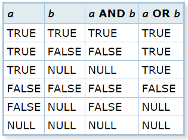

# RESUMEN DE SQL

* Temas principales
  - [Data types o tipos de datos](#data-types-o-tipos-de-datos)
  - [Jerarquia de base de datos](#jerarquia-de-base-de-datos)
  - [Comandos utiles de postgres](#comandos-utiles-de-postgres)

* Operaciones Basicas
  - [SELECT](#select)
  - [FROM](#from)
  - [WHERE](#where)
  - [ORDER BY](#order-by)
  - [GROUP BY y LIMIT](#group-by-y-limit)

* JOIN
  - []()

Postgres es un motor de bases de datos, existen tres conceptos importantes en torno a las bases de datos:

* El lenguaje
* El motor
* Servidor

Postgres es un motor de base de datos, nacido en el año 1986, que se basa en el uso de objetos relacionales.

Uno de los aspectos mas importantes es que Postgres cumple con el protocolo ACID:

* A: **Atomicidad** -> Separar las funciones desarrolladas en la BD como pequeñas tareas y ejecutarlas como un todo. Si alguna tarea falla se hace un rollback(Se deshacen los cambios)

* C: **Consistency** -> Todo lo que se desarrolló en base al objeto relacional. Los datos tienen congruencia.

* I: **Isolation**-> Varias tareas ejecutándose al mismo tiempo dentro de la BD.

* D: **Durability** -> Puedes tener seguridad que la información no se perderá por un fallo catastrófico. PostgreSQL guarda la información en una Bitácora.

Es una de las bases de datos mas utilizadas por las empresas, ya sea por el tipo de datos, su integridad, servicios adicionales y tambien por su fiabilidad y seguridad.


### DATA TYPES O TIPOS DE DATOS

En PostgreSQL disponemos de gran variedad de Data Types (tipos de datos) nativos en PostgreSQL que podemos utilizar para almacenar nuestros valores. La variedad de tipos de datos variará según para lo que necesitemos, **podemos decantarnos por los más corriente y usados**, como los tipos numéricos, de cadenas, fechas, booleanos, etc. Pero, además de éstos data types típicos, **disponemos de otros data types que no son tan corrientes y son utilizados solo para casos puntuales**, estos son los tipos binarios, enumeradores, arrays, JSONs, geométricos, Network, email y muchos más, incluso podemos **crear nuestro propio data type** muy sencillo, tan solo con un comando (CREATE TYPE).

**Tipos Numéricos (Numeric Types)**

Disponemos de tres tipos para almacenar cadenas dependiendo del número de caracteres que queramos contener. Tenemos dos tipos de longitud fija, `character varying(n)` y `character(n)`, más utilizados como `varchar(n)` y `char(n)` respectivamente. El otro tipo para almacenar cadenas es el `text`, éste último permite contener cadenas de longitud ilimitada.

**Tipos Fechas (Date / Time Type)**

Otro de los tipos más utilizados son los de tipo de fecha y hora, estos tipos suelen traer más de un quebradero de cabeza por la diversidad de los formatos que podemos utilizar. PostgreSQL nos permite separar la fecha y la hora principalmente en dos tipos, `date Type` para sólo la fecha y `time Type` para sólo la hora. También podemos obtener la fecha y la hora a la vez en un único tipo, con o sin la zona horaria éste tipo es llamado `timestamp`. Disponemos de un tipo `interval` con el que podemos establece un intervalo temporal, por ejemplo los años, meses, etc.

**Tipo Booleanos (Boolean Type)**

Éste tipo de dato es utilizado para evaluar un estado en verdadero o falso según la condición que necesitamos. En la siguiente tabla vemos una serie de valores para el campo «a» y el campo «b» y dos de las operaciones lógicas más utilizadas en el mundo informático, el resultado de estas operaciones da lugar a un estado u otro de un boolean type.

<p align="center"></p>

### JERARQUIA DE BASE DE DATOS

Toda jerarquía de base de datos se basa en los siguientes elementos:

  - **Servidor de base de datos**: Computador que tiene un motor de base de datos instalado y en ejecución.

  - **Motor de base de datos**: Software que provee un conjunto de servicios encargados de administrar una base de datos.

  - **Base de datos**: Grupo de datos que pertenecen a un mismo contexto.

  - **Esquemas de base de datos en PostgreSQL**: Grupo de objetos de base de datos que guarda relación entre sí (tablas, funciones, relaciones, secuencias).

  - **Tablas de base de datos**: Estructura que organiza los datos en filas y columnas formando una matriz.

### COMANDOS UTILES DE POSTGRES

PostgreSQL está más estrechamente acoplado al entorno UNIX que algunos otros sistemas de bases de datos, utiliza las cuentas de usuario nativas para determinar quién se conecta a ella (de forma predeterminada). El programa que se ejecuta en la consola y que permite ejecutar consultas y comandos se llama psql, psql es la terminal interactiva para trabajar con PostgreSQL, es la interfaz de línea de comando o consola principal, así como PgAdmin es la interfaz gráfica de usuario principal de PostgreSQL.

**Comandos de ayuda**
<br>
En consola los dos principales comandos con los que podemos revisar el todos los comandos y consultas son:

| Comando | Funcion |
| --- | --- |
| `\?` | Con el cual podemos ver la lista de todos los comandos disponibles en consola, comandos que empiezan con backslash ( \ ) |
| `\h` | Con este comando veremos la información de todas las consultas SQL disponibles en consola. Sirve también para buscar ayuda sobre una consulta específica, para buscar información sobre una consulta específica basta con escribir `\h` seguido del inicio de la consulta de la que se requiera ayuda, así: `\h ALTER` |

**Comandos de navegación y consulta de información**
<br>

| Comando | Funcion |
| --- | --- |
| `\c` | Saltar entre bases de datos |
| `\l` | Listar base de datos disponibles |
| `\dt` | Listar las tablas de la base de datos |
| `\d <tabla>` | Describir una tabla |
| `\dn` | Listar los esquemas de la base de datos actual |
| `\df` | Listar las funciones disponibles de la base de datos actual |
| `\dv` | Listar las vistas de la base de datos actual |
| `\du` | Listar los usuarios y sus roles de la base de datos actual |

<br>

**Comandos de inspección y ejecución**
<br>

| Comando | Funcion |
| --- | --- |
| `\g` | Volver a ejecutar el comando ejecutando justo antes |
| `\s` | Ver el historial de comandos ejecutados |
| `\s <archivo>` | Si se quiere guardar la lista de comandos ejecutados en un archivo de texto plano |
| `\i <archivo>` | Ejecutar los comandos desde un archivo |
| `\e` | Permite abrir un editor de texto plano, escribir comandos y ejecutar en lote. `\e` abre el editor de texto, escribir allí todos los comandos, luego guardar los cambios y cerrar, al cerrar se ejecutarán todos los comandos guardados. |
| `\ef` | Equivalente al comando anterior pero permite editar también funciones en PostgreSQL |

<br>

**Comandos para debug, optimización y cerrar la consola**
<br>

| Comando | Funcion |
| --- | --- |
| `\timing` | Activar / Desactivar el contador de tiempo por consulta |
| `\q` | Cerrar la consola |


## Operaciones basicas

### SELECT

<br>

Una instruccion `SELECT` se usa para especificar los nombres de los campos que contienen los datos que quiere usar en una consulta. También puede usar expresiones en lugar de o además de los campos. Incluso puede usar otra instrucción `SELECT` como campo, esto se conoce como una subconsulta.

```sql
SELECT name;
```

Si no desea hacer una seleccion especifica y solo desea traer todos los datos disponible, puede utilizar el operador `*`.

```sql
SELECT *;
```

Puede usar un nombre distinto para hacer referencia al elemento en una instrucción `SELECT`. Un alias es un nombre que se asigna a un origen de datos en una consulta al usar una expresión como un origen de datos, o para hacer que la instrucción SQL sea más fácil de escribir y leer.

```sql
SELECT nombre_de_pila AS nombre;
```
<br>

### FROM

La instruccion `FROM` se usa para especificar la tabla de donde se extraera la informacion previamente especificada en la instruccion `SELECT`.

```sql
SELECT nombre 
FROM familias;
```

Al igual que la instruccion `SELECT`, tambien puede usar un nombre distinto para hacer referencia a una tabla en una instrucción `SELECT` si usa un alias de tabla en la instruccion `FROM`. 

```sql
SELECT nombre AS n 
FROM familias AS f;
```

Al usar alias de tabla en la instruccion `FROM`, podría escribir la consulta con mayor facilidad. La instruccion `FROM`, con alias de tabla, sería similar a la siguiente:

```sql
SELECT c.ID, o.ID
FROM familias_1 AS c, familias_2 AS o;
```
<br>

### WHERE

`WHERE` es usado para filtrar registros y sólo extrae los registros que cumplen un determinado criterio. 

<br>

```sql
SELECT *
FROM tabla
WHERE id = 1;

SELECT * 
FROM tabla
WHERE id > 1;

SELECT * 
FROM tabla
WHERE id < 1;
```

<br>

Tambien puedes combinar esta instruccion con otros operadores para lograr una mayor precision en la busqueda:

<br>

```sql
SELECT *
FROM tabla
WHERE id > 1 AND id < 2 

SELECT *
FROM tabla_diaria
WHERE cantidad BETWEEN 10 AND cantidad < 100;
```

<br>

La separacion por parentesis es muy importante a la hora de realizar ciertas consultas:

<br>

```sql

-- Mientras que la primera consulta traera los registros cuyo nombre sera Israel y apellido Vazquez o Lopez
-- La segunda consulta traera todos los registros cuyo nombre sea Israel y apellido Vazquez o registros con apellido Lopez

SELECT * 
FROM users
WHERE name = "Israel"
	AND (
	lastname = "Vázquez"
	OR
	lastname = "López"
);

SELECT * 
FROM users
WHERE name = "Israel"
	AND 
	lastname = "Vázquez"
	OR
	lastname = "López";
```

<br>

Tambien disponemos del operador `NOT` que valida que un dato no sea `TRUE`:

<br>

```sql
SELECT column1, column2, ...
FROM table_name
WHERE NOT condition;
```
<br>

Para especificar patrones en una columna usamos `LIKE`. Podemos mostrar diferentes cosas que buscamos e incluso combinar con otrso operadores:

<br>

```sql
-- registros que comiencen con Is sin importar los caracteres siguientes
SELECT *
FROM users
WHERE name LIKE "Is%";

-- registros que comiencen con Is y terminen con ael
SELECT *
FROM users
WHERE name LIKE "Is_ael";

-- registros que no comiecen con Is y terminen con ael
SELECT *
FROM users
WHERE name NOT LIKE "Is_ael";
```

<br>

Para especificar si queremos registros cuyos datos pueden o no ser nulos, disponemos del operador `NULL`:

<br>

```sql
SELECT * 
FROM users
WHERE name IS NULL;

SELECT *
FROM users
WHERE name IS NOT NULL;
```

<br>

Y para especificar registros cuyos datos pueden variar entre ciertas opciones, disponemos del operador `IN`:

<br>

```sql
SELECT *
FROM users
WHERE name IN ('Israel','Laura','Luis');
```

<br>

### ORDER BY

Las instrucciones `SELECT`, `FROM` (*con sus respectivos join*) y `WHERE` son las mas importantes y mas usadas dentro de una Query. Pero existen otras consultas opcionales como `ORDER BY` que son opcionales pero pueden ser de gran ayuda a la hora de leer la informacion disponible.

`ORDER BY` se usa para ordenar de forma ascendente o descendente los registros obtenidos de una tabla. Por defecto todos los registros son mostrados de forma descendiente o `ASC`, pero podemos usar el operador `DESC` para cambiar este orden.

<br>

```sql
SELECT *
FROM tabla_diaria
ORDER BY fecha;

SELECT *
FROM tabla_diaria
ORDER BY fecha DESC;
```

<br>


### GROUP BY y LIMIT

La sentencia `GROUP BY` identifica una columna seleccionada para utilizarla para agrupar resultados. Divide los datos en grupos por los valores de la columna especificada, y devuelve una fila de resultados para cada grupo. 

Todas las columnas seleccionadas sin una agregación asociada deben aparecer en la cláusula `GROUP BY`:

<bn>

```sql
-- Esta consulta agrupa los registros en base a la columna DTO y utiliza la funcion AVG() para devolver un promedio en torno al salario por departamento

SELECT DTO, AVG(salario)
FROM empleados
GROUP BY DTO;
```

Resultado:

```
    DTO                 COL1
  ------  ------------------
      10    20865,8625000000
      15    15482,3325000000
      20    16071,5250000000
      38    15457,1100000000
      42    14592,2625000000
      51    17218,1600000000
      66    17215,2400000000
      84    16536,7500000000
```

<br>

La cláusula `LIMIT` se usa para restringir los registros que se retornan en una consulta  `SELECT`.

Recibe 1 ó 2 argumentos numéricos enteros positivos; el primero indica el número del primer registro a retornar, el segundo, el número máximo de registros a retornar. El número de registro inicial es 0 (no 1).

Si el segundo argumento supera la cantidad de registros de la tabla, se limita hasta el último registro.

<br>

```sql
-- Mostrar los primeros cuatro registros
SELECT *
FROM libros
LIMIT 0,4;
```

<br>

La instruccion `LIMIT` tambien puede combinarse con el `DELETE`. Por ejemplo:

<br>

```sql
DELETE FROM tabla
LIMIT 2;
```

<br>

Incluso podemos ordenar los registros en torno a un valor y a partir de alli podemos ejecutar la instruccion `DELETE`:

<br>

```sql
DELETE FROM tabla
ORDER BY dato
LIMIT 2;
```

<br>

## JOIN

`JOIN` es el proceso de tomar datos de varias tablas y colocarlos en una vista generada. Por tanto, una instrucción de `JOIN` en un comando `SELECT` combina las columnas entre una o más tablas en una base de datos relacional y retorna a un conjunto de datos.

Este comando se utiliza en conjunto con la instruccion `FROM` para poder relacionar las tablas en base a un criterio:

```sql
SELECT *
FROM trabajadores AS t
JOIN area AS a 
ON t.area_id = a.id;
```

Sin embargo existen diferentes tipos de `join` por lo cual tomaremos un ejemplo practico y a travez de el comenzaremos a explicar en detalle cada tipo de `join`. Asumamos que tenemos dos tablas:

<br>

<div align='center'>
  
  
</div>

<br>

### INNER JOIN

La `INNER JOIN` o `JOIN` examina cada fila de la primera tabla (*basket_a*). Compara el valor de la columna fruit_a con el valor de la columna fruit_b de cada fila de la segunda tabla (*basket_b*). Si estos valores son iguales, la unión interna crea una nueva fila que contiene columnas de ambas tablas y añade esta nueva fila al conjunto de resultados.

<br>

```sql
SELECT 
    a,fruit_a,
    b,fruit_b
FROM basket_a
INNER JOIN basket_b
  ON fruit_a = fruit_b;
```
<br>

<div align='center'>
  
</div>

<br>

### LEFT JOIN

La siguiente sentencia utiliza la cláusula `LEFT JOIN` para unir la tabla *basket_a* con la tabla *basket_b*. En el contexto de la unión izquierda, la primera tabla se denomina tabla izquierda y la segunda tabla se denomina tabla derecha.


<br>

```sql
SELECT
    a,fruit_a,
    b,fruit_b
FROM basket_a
LEFT JOIN basket_b 
  ON fruit_a = fruit_b;
```

<br>

<div align='center'>
  
</div>

The `LEFT JOIN` comienza seleccionando datos de la tabla izquierda. Compara los valores de la columna *fruit_a* con los valores de la columna *fruit_b* de la tabla *basket_b*.

Si estos valores son iguales, `LEFT JOIN` crea una nueva fila que contiene columnas de ambas tablas y añade esta nueva fila al conjunto de resultados.

En caso de que los valores no sean iguales, `LEFT JOIN` también crea una nueva fila que contiene columnas de ambas tablas y la añade al conjunto de resultados. Sin embargo, rellena las columnas de la tabla derecha (basket_b) con null.

<br>

### LEFT OUTER JOIN

Para seleccionar filas de la tabla izquierda que no tienen filas coincidentes en la tabla derecha, se utiliza la unión izquierda con una cláusula WHERE. 

<br>

```sql
SELECT
    a,fruit_a,
    b,fruit_b
FROM basket_a
LEFT JOIN basket_b 
  ON fruit_a = fruit_b
WHERE b IS NULL;
```

<br>

<div align='center'>
  
</div>

<br>

### RIGHT JOIN

La `RIGHT JOIN` es una versión inversa de `LEFT JOIN`. Empieza seleccionando datos de la tabla derecha. Compara cada valor de la columna *fruit_b* de cada fila de la tabla derecha con cada valor de la columna *fruit_a* de cada fila de la tabla *fruit_a*. Si estos valores son iguales, se crea una nueva fila que contiene columnas de ambas tablas.

Si estos valores son iguales, la `RIGHT JOIN` crea una nueva fila que contiene columnas de ambas tablas.

En caso de que estos valores no sean iguales, la `RIGHT JOIN` también crea una nueva fila que contiene columnas de ambas tablas. Sin embargo, rellena las columnas de la tabla izquierda con NULL.

La siguiente sentencia utiliza la `RIGHT JOIN` para unir la tabla *basket_a* con la tabla *basket_b*:

<br>

```sql
SELECT
    a,fruit_a,
    b,fruit_b
FROMbasket_a
RIGHT JOIN basket_b 
  ON fruit_a = fruit_b;
```

<br>

<div align='center'>
  
</div>

<br>

### RIGHT OUTER JOIN

Del mismo modo, puede obtener filas de la tabla derecha que no tengan filas coincidentes de la tabla izquierda añadiendo una cláusula WHERE como se indica a continuación:

<br>

```sql
SELECT
    a,fruit_a,
    b,fruit_b
FROM basket_a
RIGHT JOIN basket_b 
  ON fruit_a = fruit_b
WHERE a IS NULL;
```

<br>

<div align='center'>
  
</div>

<br>

### FULL OUTER JOIN

La `FULL OUTER JOIN` o *full join* devuelve un conjunto de resultados que contiene todas las filas de las tablas izquierda y derecha, con las filas coincidentes de ambos lados si están disponibles. En caso de que no haya ninguna coincidencia, las columnas de la tabla se rellenarán con NULL.

<br>

```sql
SELECT
    a,fruit_a,
    b,fruit_b
FROM basket_a
FULL OUTER JOIN basket_b 
  ON fruit_a = fruit_b;
```

<br>

<div align='center'>
  
</div>

<br>

Para devolver filas en una tabla que no tienen filas coincidentes en la otra, se utiliza la unión completa con una cláusula WHERE como ésta:

<br>

```sql
SELECT
    a,fruit_a,
    b,fruit_b
FROM basket_a
FULL OUTER JOIN basket_b 
  ON fruit_a = fruit_b
WHERE a IS NULL OR b IS NULL;
```

<br>

<div align='center'>
  
</div>

<br>

La siguiente imagen muestra todas las uniones PostgreSQL que hemos discutido hasta ahora con la sintaxis detallada:

<br>

<div align='center'>
  
</div>

<br>